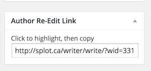
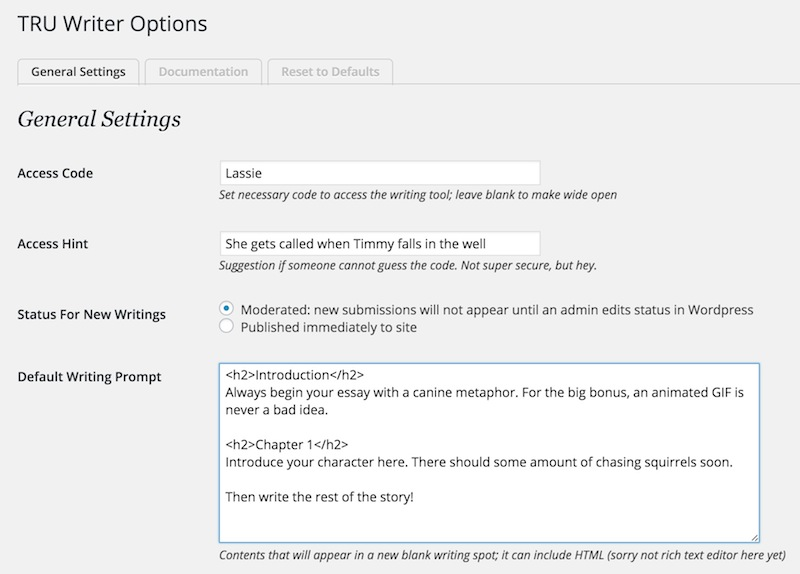
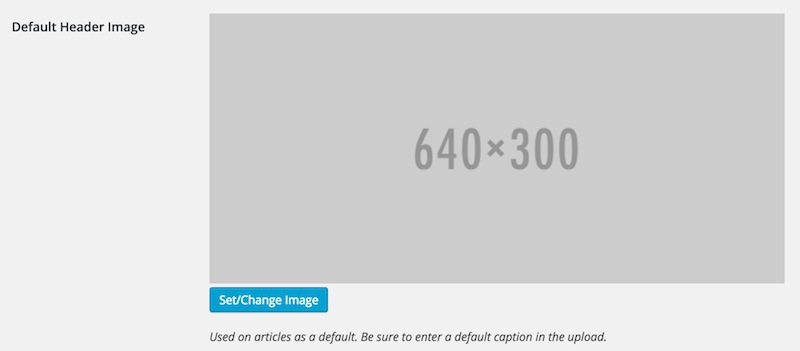
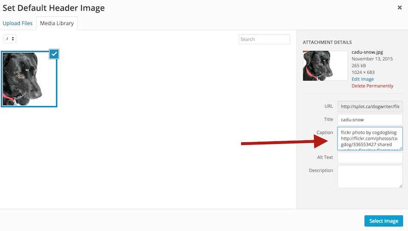
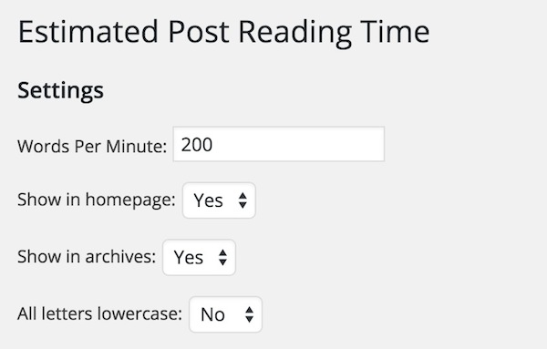

# TRU Writer Wordpress Theme
by Alan Levine http://cogdog.info/ or http://cogdogblog.com/

## What is this?
This Wordpress Theme powers [TRU Writer](http://splot.ca/writer/); a site that allows people to publish their writing, including media content, without needing to login or understand the backend of  Wordpress. 

Once installed the TRU Writer theme allows individuals to generate content online using an editor interface inside their browser. Writers can also add content by cutting and then pasting into the editor from word-processing software such as MS Word or Google Docs, carrying forward most structural formatting (here's an example of a  post [created by using the copy/paste function (cmd/ctrl + V) from a Word document](http://splot.ca/writer/2014/101). 

Because it requires no login or CMS knowledge, TRU writer is great for projects where multiple people are contributing or for classroom applications where many individuals need to publish content on the same site. It focuses on the writing rather than Wordpress (not that we do not love you, Wordpress!)

The site invisibly logs in visitors to a special account to make available advanced publication and editing tools, but those individuals will not need to navigate the Wordpress dashboard or login structure (we love Wordpress, but hey, not everyone needs to see that dashboard, right?). The TRU Writer allows individuals to publish anonymously, or under an assumed name, or their own name, or whatever. 

The TRU Writer Theme was developed along with the [TRU Collector](http://splot.ca/splots/the-comparator/), the [TRU Sounder](http://splot.ca/splots/tru-sounder/), [The Comparator](http://splot.ca/splots/the-comparator/), and the [Daily Blank](http://splot.ca/splots/the-daily-blank/) [while on a fellowship](http://cogdog.trubox.ca) at [Thompson Rivers University](http://tru.ca/)--that's why the "TRU" in the theme name.

Here's some places you can see others putting the TRU Writer Theme in action:

* [30,000,000 ACA Stories](http://30millionlike.me)
* [Alan Levine’s Publications for a portfolio](http://cogdogpapers.trubox.ca/)
* [ENGL205 @ UNBC](http://unbc.engl205.ca/) Fiction (University of Northern British Columbia)
* [ENGL485 @ UNBC](http://unbc.engl485.ca/) Special Topics in Modern and Contemporary Literature in the US (University of Northern British Columbia)
* [BIOL 312 @ UNBC](http://unbc.biol312.ca/) Molecular Biology (University of Northern British Columbia)
* [BIOL 420 @ UNBC](http://unbc.biol420.ca/) Animal Behaviour (University of Northern British Columbia)
* [Comics and Mass Media](http://graphixia.ca/comicsandmassmedia) (Graphixia)
* [ENGL 1110 Writer, TRU](http://engl1110writer.trubox.ca/) Thompson Rivers University English course
* [ENGL 4790 Writer, TRU](http://engl4790writer.trubox.ca/) Thompson Rivers University English course
* [IASK106 Writer](http://unbc.iask107.ca/) Big Questions course (University of Northern British Columbia)
* [Lee and Brenna's Class Blog](http://www.english2point0.ca/nationalistsuperhero/) Nationalist Superhero (Douglas College)
* [Lexical Confessions](http://lexicalconfessions.com/blog/)
* [L21C Lawyering in the 21st Century, TRU](http://l21c.trubox.ca/)  Thompson Rivers University Law course 
* [Prototype for Small Cities Imprint journal](http://smallcities.trubox.ca/)
* [Research Methodology in Education](http://lled500.trubox.ca/) (University of British Columbia)
* [The Apocalypse in Film and Literature](http://engl3140.trubox.ca/) Thompson Rivers University English course
* [TRU Undergraduate Research Journal](http://undergradjournal.trubox.ca/) 
* [TRU Writer SPLOT demo site](http://splot.ca/writer/)
* [UDG Agora Comparte](http://udg.theagoraonline.net/comparte) (this version has a few more custom fields and is translated into Spanish)
* [When I Needed Help](http://whenineededhelp.com/)

And if you make a TRU Writer site, please please pretty please fork this repo to edit this Readme with a link to your new site.

If you have problems, feature suggestions, small bags of gold coin for me, please [contact me via the issues area](https://github.com/cogdog/truwriter/issues) on this repo.

## Relatively Cool New Features

**Separate CSS / Functions for Custom Installs** Created a new PHP file in `includes` for any custom site code and a style sheet in `styles/custom/css` for styles added for a specific site. This way, if you keep copies of these in a safe place, you can more safely update the theme. Also fixed quote bug for captions, and changed writing form so it only displays featured image and intro text for first view of the form (so you can add really long instructions).

**Tweet This Button** There is a new option so you can have your own hashtags added when someone tweets a published item. Also, twitter card meta data has been added so these tweets have the extended card display that shows the featured image, the site's title, and an excerpt from the item-- example https://twitter.com/cogdog/status/822656183769198593

**Options Refreshed, Auto Page Creation, Better Reading Time Display** Recoded the theme options so documentation in its own tab. When he theme is activated now, the necessary pages will be created automagically. And if the Estimated reading time plugin is not activated, nothing will be displayed where it normally displays.

**Provide an Email, Edit your Work Later** A major limitation of the first versions was that authors had no ability to edit their work after publishing (that's what happens when you don't have logins). As of November 2015, authors have a new field where they can enter an email address- if this is provided (it is not required), they will receive via email a special coded URL they can use at anytime to modify their work.

When published, any writing with an email is published with a `Get Edit Link` button at the bottom which will resend the link to the email associated with it.

**Admins Can Get Edit Link for Anybody** Even if the author does not provide an email address, in the Wordpress Dashboard interface, editors and admins can click and copy an edit like they can provide directly to a writer (this is added as a side metabox).

## How to Install TRU Writer
Using this theme requires a self-hosted--or institutionally hosted (lucky you)-- Wordpress site (the kind that you download from [wordpress.org](http://www.wordpress.org). You cannot use this theme on the free "wordpress.com" site. Maybe check out [Reclaim Hosting](https://reclaimhosting.com/) if you need to set up your own hosting space. 

You will need to be able to install themes and plugins. The TRU Writer is  based on [the free Radcliffe theme by Anders Noren](https://wordpress.org/themes/radcliffe), which is also included in this repo. 

Upload the **tru-writer** and the **radcliffee** directories (from wp-content/ in this distro) to your site's wp-content/themes directory. 

Or if you wish to install from within the Wordpress Dashboard, from **Appearance** select **Themes** and click the **Upload** links.  A zip of both themes is included with this repo, or you can download directly [installable-ds106banker.zip](https://github.com/cogdog/truwriter/blob/master/installable-tru-writer.zip) and  [installable-wp-bootstrap.zip](https://github.com/cogdog/truwriter/blob/master/radcliffee.zip) 

To get the TRU Writer working all you need to do is activate the "TRU Writer" theme when it appears in your Wordpress dashboard under "appearance" --> "themes." It should appear there as soon as you upload it or add it via .zip file. You don't need to activate "radcliffe," but it's nice to have if you ever want to use that theme for something else later on. Once you activate the theme in the "appearance" menu, you are pretty much ready to go. But you'll still need to get things in order by entering some info.      

## Recommended Plugins for TRU Writer

While your doing all that uploading, you should know that this theme uses the [Estimated Post Reading Time plugin](http://wordpress.org/extend/plugins/estimated-post-reading-time/) to insert those commonplace estimates of reading time -- blame [Medium](http://www.medium.com) if you hate knowing how long a post might take to read. These are the setting you should use for this plugin:

* **Words Per Minute** We use the default of 250, but you can pick any number that feels appropriate
* **Add automatically to all posts and pages:** NO (the theme takes care of this, and it will look bad if you try "Yes")
* **Show in homepage:** Yes
* **Show in archives:** Yes
* **All letters lowercase:** No 

Also install and activate the [Remove Dashboard Access plugin](https://wordpress.org/plugins/remove-dashboard-access-for-non-admins/). This plugin this keeps anyone logged in as the secret user from even seeing the Wordpress dashboard. It also stops someone who is leaving a comment from getting inside the secret user profile and changing your "writer" password, which blows everything up. This plugin is not critical for the Writer to work, it just closes the back door a bit tighter.

In the settings for Remove Dashboard Access plugin, restrict access to **Editors and Administrators** or just **Administrators** depending if you will have a moderator user. The default redirect should be for the main URL of the site.

At the same time, and you already know this because you know Wordpress, but activate the [Akismet plugin](https://wordpress.org/plugins/akismet/). Get that rolling so things don't get nuts in the comment box. 

Your admin password is solid, right? Really? You updated Wordpress to the latest version, right? And you do regular backups of Wordpress right? ... maybe you have a set schedule for backing up the site content? You wouldn't want to lose people's stuff. No, no you would not. 

Now that you've installed TRU Writer and can see the barebones theme staring back at you. It is not very interesting. Yet.

## Page Setup
This theme has several pages that must be created; each is associated with a specific template that provide it's functionality. The theme should create these all for you when the theme is activated, but if not, create them as described below. You can edit the content of the **Write** and **Desk** pages to customize the prompt seen by writers on your site.

If the theme does not do so automatically (and it should) create these Wordpress **Pages**. You can modify the titles, and add whatever content you want to appear at the top as instructions, but do not change the slug or short name.

* **Write** -- The page that provides the writing form see [http://splot.ca/writer/write](http://splot.ca/writer/write). You can title it whatever you like, but the slug (url name) must be `write`  Whatever you include in the body (not required) is added to the top of the form, maybe for extra instructions.e.g. for a site at `http://coolest.site.org/` the page must be published at `http://coolest.site.org/write`

* **Desk** -- The page that provides users will see first if they must enter an access code to access the writing tool (see below). If no access code is required, it redirects to the page above for the writing form-- like  [http://splot.ca/writer/desk](http://splot.ca/writer/desk). You can title it whatever you like, but the slug (url name) must be `desk` Whatever you include in the body (not required) is added to the top of the form, maybe for a friendly prompt .e.g. for a site at `http://coolest.site.org/` the page must be published at `http://coolest.site.org/desk`

* **Random** -- No one ever sees this page, and it is not strictly required, but it is fun;  see [http://splot.ca/writer/random](http://splot.ca/writer/random)  It is used to send a visitor to a randomly published item. The slug (url name) must be `random` .e.g. for a site at `http://coolest.site.org/` the page must be published at `http://coolest.site.org/random`

* **Get Edit Link** -- No one ever sees this page, but it's important! - it is used to generate an email to send an editing link to an author. The the slug (url name) must be `get-edit-link` .e.g. for a site at `http://coolest.site.org/` the page must be published at `http://coolest.site.org/get-edit-link`

## Customize Your Menus
The default menus are not what you want (it will add menu items for some pages that users should not see! Wordpress will generate one based on all Pages set up.

In Wordpress Dashboard go to Appearance -&gt; Menus. Create a new menu, and check the location box for "Primary". A typical TRu Writer menu might have an "About Page", the Write page (the form for writing), maybe a Random link, and a set of dropdowns to see pages by category. Here is one example for the site http://splot.ca/Writer

You can of course, create any menu structure that works for your site- but don't use the default! And hey, if you're being all fancy and don't check the "Primary" box above, remember to go into the "Manage Menus" tab and change it from the default menu to the new awesome menu you just created or all you'll see is the default menu popping up again and again and that will be frustrating.  It will list as menu items a bunch of pages that users never should see (e.g. Welcome Desk, Get Edit Link).

## Theme Options and Settings
Upon activation the theme will set up a **TRU Writer Options** link that appears in the black admin bar at the top of your Wordpress Dashboard interface (when logged in), and in the "Appearance" tab on your Wordpress Dashboard. 

Click **TRU Writer Options** to see or change the settings outlined below. 
    
 *(For extra fun "writer" from here on, in lower case, refers to the person using your site; the person who comes and wants to write something on your awesome Writer site.)*

In the TRU Writer Theme, traditional "posts" in Wordpress are renamed "writings," but they still have all the attributes of garden variety Wordpress blog posts. Yum.

## Access Code and Hint
Leave this field blank if you want any visitor to be able to access the writing form on your TRU Writer site. If that's too open for you, add a code and give it a hint. If you want a quick workaround here, make the site less accessible by not having any links in the homepage menu bar that go to the editor page--no link to the "writer" page, the harder it is to find the editor and post something.  

If you want to require users to enter an access code (a very weak password), just enter it in the space provided. Any requests to access the editor and write a post will be sent to a front-page where a writer must enter the passcode. As an example, we have "Lassie" and an equally difficult hint. If you enter in "Lassie," you can see the editor and begin the process of writing a post--but don't actually do that; we haven't set everything up yet! This is a hypothetical situation. For now, decide if you want a passcode. If you do, put it in, with a hint. If you don't, moving on!

## Status for New Writings
The TRU Writer is a moderated publishing theme. And "moderated" means that when a writer submits something, it is not  immediately visible to the world. Instead, unless you set it otherwise (more on that below), when a writer submits a post (or "writing" as above) they are automatically set as drafts with a  *Pending Approval* status. You'll get notifications that a submissions has been made to the Email address you enter in the "Notifications Email" option. 

In order to make a post (or "writing" as above) visible, a user with the permission status of "Editor" or "Administrator" needs to change the status of the "pending approval" writing to "published (or ignore an "Editor" or "Administrator" could just ignore it forever, such power is theirs).

You can also choose the "status for new writings" as "publish immediately" and there are no checks and balances--the writing goes right up and is publicly visible immediately. Immediate gratification goes a long way. Note though, that because of the hollow tunnel this might create, this option works best with an access code as described above in place--right Lassie!?

## Default Writing Prompt
Enter this field to pre-populate the field that visitors write use to compose their work. You can provide a prompt or set up a structure. HTML is acceptable, but for now, there is no rich text editor here. *Learn some web code!* It will set you free.

## Allow Comments
Check this box to add a standard blog comment field at the bottom of all published pieces. Writers like comments. Don't you?

If you allow comments--and you should--be sure to install and activate the [Remove Dashboard Access plugin](https://wordpress.org/plugins/remove-dashboard-access-for-non-admins/) (instructions above), or else there could be trouble. 

## Extra Information Field
On the editor where people will be composing their madness, this represents a place for them to add extra information that is not part of the final published item, but that the administrator or editor might need to know, or might have requested. As an example, if you are using this theme to host multiple sections of a class or course of study, you might want to populate the prompt for this field with something like "Include your name and course section" or, "name the dog that best represents you" or "tell me why your writing is so late."

These end up in a **Custom Field** named "wEditorNotes," which you can view when editing the post in order to publish it (not the "quick edit"; the full monty "edit" please). You will need to open the Screen Options toggle at the top of the Wordpress Dashboard interface and click the box that makes the Custom Fields available. The information is also included in the notification emails announcing a new writing in need of approval.

## Default Header Image
Click **Set/Change Image** to open the Wordpress media editor. Drop an image that you wish to be used as a default one if a writer does not include one of their own. The `640 x 300` dimensions are a minimum size, and represent a reasonable aspect ratio for a header image. Larger is better; and the image will be cropped along the middle of the image.

Before choosing the image, be sure to add a caption (we suggest a creative commons license!) as this is what is used to display atop the image when published. Attribute and model attribution! FTW!

Without proper attribute, the post / writing will not move forward. Attribution must be in there. 

Once selected you will see a preview of your default image. Isn't Cadu a nice looking dog?

## Default Category for New Writing
If you have not set up any categories, this menu will not do much. You might want to save your options and go edit your **Writing Categories**. On activation the TRU Writer will pre-create two categories it uses to organize what is submitted and published.

The `In Progress` category is where all submitted writings go if they need approval. Final Published items have their own ... `Published` category (big surprise there, eh?). If you want to give your writers a choice of categories to place their work, make sure any categories you create have `Published` as a parent.

So we suggest making a few pre-set categories for a new site. As an Administrator you can always add new ones at any time. Any text you add as a description will be included on the writing form.

## Notification Emails
Enter any email addresses who should be notified if new submissions; you have multiple ones if you separate them by a comma. Or leave blank if you never want to know what's going on in your site.

## Tweeted hashtags
Enter one or more hashtags to be used when a published item is shared via the Tweet This button. Do not include "#" and separate multiple ones with commas

## Estimated Reading Time Plugin
This plugin is optional, if installed and activated, it will add to all published works an estimate of the reading time based on a crude formula. If it is not installed, you will see the notes shown above. This plugin is available in the Wordpress repository, so it is an easy install.

If installed, you should check the settings under **Settings** -- **Post Reading Time**. Set `Show in Home Page` and `Show in Archives` to display in listings of published works.

## Author Account Setup
To provide access to the media uploader, this site uses a Wordpress Authoring Role account that is logged into invisibly to your site visitors (for anyone logged in with an Editor or Administrator account, like you this account is not used.). So your site needs an active user with a name of **writer** and a role of **Author**.

You can follow the link to create an account; for an email you can use a fictitious one on your domain. We suggest using the strong password that Wordpress suggests. Copy that password, and perhaps save it in a safe place. On a stand alone site, you can just paste it into the password field.

If this site is on a multi-site Wordpress, and the TRU Writer has been used on another site, the write account, already exists, so you need to add it to the site via the Author tools. However, you still have to enter the password, so make sure you know the password that was used on another site. If you do not have access to it, you will have to reset the password at the Network Admin level, and then update the password on the options of all sites using the TRU Writer.

You can now see the password expected for the secret account.

## Creative Commons Settings

Creative commons licenses can be attached to all works published on your site. Choose **Apply one license to all challenges** to place the same license on all works (a notice will be displayed on the writing form).

Or you can the Creative Commons options to **Enable users to choose license** which will put the menu on the submission form so users can choose a license (or set to All Rights Reserved). At this time, the only way to edit the licenses displayed (e.g. if you do not want certain ones) is to edit `functions.php` in the template directory. Look for the function `function cc_license_select_options` and comment out the lines containing license options to hide.

## The Complexish Stuff for Nerds, Who Are Awesome

If you want to customize/re-arrange the buttons and controls on the rich text editor used by writers on your site, install [TinyMCE Advanced](https://wordpress.org/plugins/tinymce-advanced/). There is [a file in the theme](wp-content/themes/tru-writer/includes/tinymce-advanced-settings.txt)  with the typical settings for this plugin I use when I set up these sites.

You can copy and paste from that .txt file into the import field of the settings for TinyMCE Advanced (it's a small chunk of json).

