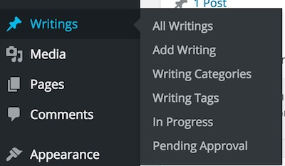
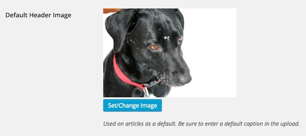
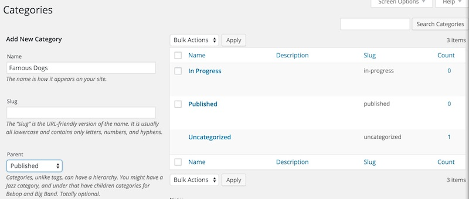

# TRU Writer Wordpress Theme
by Alan Levine http://cogdog.info/ or http://cogdogblog.com/

## What is this?
This Wordpress Theme powers [TRU Writer](http://splot.ca/writer/); a site that allows people to publish their writing, including media content, without needing to login or understand the backend of the Wordpress Content Management System (CMS). Once installed, the TRU Writer theme allows individuals to generate content online using an editor interface inside their browser or, to add content by cutting and then pasting into the editor from word-processing software such as MS Word, carrying forward most formatting (here's an example of a  post [created by using the copy/paste function (cmd/ctrl + V) from a Word document](http://splot.ca/writer/2014/101). Because it requires no login or CMS knowledge, TRU writer is great for projects where multiple people are contributing or for classroom applications where many individuals need to publish content on the same site. 

Basically, the site invisibly logs in visitors to a special account and reveals advanced publication and editing tools, but those individuals will not need to navigate the Wordpress dashboard or login structure (we love Wordpress, but hey, not everyone needs to see that dashboard, right?). The TRU Writer allows individuals to publish anonymously, or under an assumed name, or their own name, or whatever. Point is, only the website administrator needs to do anything to generate the posts--and even they can automate that process! No one else needs to see anything under the hood.  

The TRU Writer Theme was developed along with the [TRU Collector](http://splot.ca/splots/the-comparator/), the [TRU Sounder](http://splot.ca/splots/tru-sounder/), [The Comparator](http://splot.ca/splots/the-comparator/), and the [Daily Blank](http://splot.ca/splots/the-daily-blank/) [[while on a fellowship](http://cogdog.trubox.ca) at [Thompson Rivers University](http://tru.ca/)--that's why the "TRU" in the theme name.

Here's some examples, and place where you can see other versions of the TRU Writer Theme in action:

* [Web 2.0 Storytelling Article](images/web2storytelling.jpg)](http://splot.ca/writer/2014/101)
>>>>>>> origin/master
* [TRU Writer SPLOT demo site](http://splot.ca/writer/) (there might be occasional breakage if testing new features)
* [Comics and Mass Media](http://graphixia.ca/comicsandmassmedia) (Graphaxia)
* [Research Methodology in Education](http://lled500.trubox.ca/) (University of British Columbia)
* [UDG Agora Comparte](http://udg.theagoraonline.net/comparte) (this version has a few more custom fields)
* [The Apocalypse in Film and Literature](http://engl3140.trubox.ca/) Thompson Rivers University English course
* [L21C Lawyering in the 21st Century, TRU](http://l21c.trubox.ca/)  Thompson Rivers University Law course 
* [ENGL 4790 Writer, TRU](http://engl4790writer.trubox.ca/) Thompson Rivers University English course
* [ENGL 1110 Writer, TRU](http://engl1110writer.trubox.ca/) Thompson Rivers University English course
* [Prototype for Small Cities Imprint journal](http://smallcities.trubox.ca/)
* [TRU Undergraduate Research Journal](http://undergradjournal.trubox.ca/) 
* [Alan Levine’s Publications for a portfolio](http://cogdogpapers.trubox.ca/)

## Relatively New Features

**Provide an Email, Edit your Work Later** A major limitation of the first versions was that authors had no ability to edit their work after publishing (that's what happens when you don't have logins). As of November 2015, authors have a new field where they can enter an email address- if this is provided (and it is not required), they will receive via email a special coded URL they can use at anytime to modify their work.

When published, any writing with an email is published with a `Get Edit Link` button at the bottom which will resend the link to the email associated with the item.

**Admins Can Get Edit Link for Anybody** Even if the author does not provide an email address, in the Wordpress Dashboard interface, editors and admins can click and copy an edit like they can provide directly to a writer (this is added as a side metabox).

## How to Install
Using this theme requires a self-hosted--or institutionally hosted (lucky you)--Wordpress site (the kind that you download from [wordpress.org](http://www.wordpress.org). You cannot use this theme on the free "wordpress.com" site. Maybe check out [Reclaim Hosting](https://reclaimhosting.com/) if you need to set up your own hosting space. 

You will need to be able to install themes and plugins. The TRU Writer is  based on [the free Radcliffe theme by Anders Noren](https://wordpress.org/themes/radcliffe), which is also included in this repo (but you should update it once you install the theme). If you have found your way to GitHub, you'll probably know that you cannot install the downloaded .zip file from here into your themes folder in Wordpress. Instead, download the repository as a .zip file and then unpack the .zip file "truwriter-master" on your computer (you can find it in the folder where all your downloads go). Once you have done that, open the folder named "truwriter-master" and look for the folder "wp-content" --> "themes." Inside the "themes" folder you will find two ore folders: "radcliffe" and "tru-writer." Now, remembering where those folders are, go and upload them to the "wp-content" --> "themes" folder on your self-hosted server (wherever you installed Wordpress). Or, if you are so inclined, you can make the "tru-writer" folder into a .zip file and upload it in the Wordpress dashboard under "add themes" (and add "radcliffe" while you're at it; let's play nice). 

To get the TRU Writer working all you need to do is activate the "TRU Writer" theme when it appears in your Wordpress dashboard under "appearance" --> "themes." It should appear there as soon as you upload it or add it via .zip file. You don't need to activate "radcliffe," but it's nice to have if you ever want to use that theme for something else later on. Once you activate the theme in the "appearance" menu, you are pretty much ready to go. But you'll still need to get things in order by entering some info.      

## Recommended Plugins

While your doing all that uploading, you should know that this theme uses the [Estimated Post Reading Time plugin](http://wordpress.org/extend/plugins/estimated-post-reading-time/) to insert those commonplace estimates of reading time -- blame [Medium](http://www.medium.com) if you hate knowing how long a post might take to read. And, if you hate estimates, then don't install the plugin. But, the theme uses them, if you activate it. The theme's options panel will nudge you to install it. You can choose to comply, or not.

Also install and activate the [Remove Dashboard Access plugin](https://wordpress.org/plugins/remove-dashboard-access-for-non-admins/) - this keeps anyone logged in as the sedret user from even seeing the wordpress dashboard.  In its settings, restrict access to **Editors and Administrators** or just **Administrators** depending if you will have a moderator user. The default redirect should be for the main URL of the site.

At the same time, and you already know this because you know Wordpress, but activate the [Akismet plugin](https://wordpress.org/plugins/akismet/). Get that rolling so things don't get nuts in the comment box. 

Your admin password is solid, right? Really? You updated Wordpress to the latest version, right? And you do regular backups of Wordpress right? ... maybe you have a set schedule for backing up the site content? You wouldn't want to lose people's stuff. No, no you would not. 

Now that you've installed TRU Writer and can see the barebones theme staring back at you:

## Theme Options and Settings
Upon activation the theme will create a few Wordpress "Pages" that it needs ("write"; "random"; "welcome desk"; "get edit link"), some categories ("published"' "in-progress"), and will set up a **TRU Writer Options** link that will appear in your admin bar at the top of your Wordpress Dashboard interface, and in the "appearance" tab on your Wordpress Dashboard. 

Click that to make all settings outlined below.     
(For extra fun "writer" from here on, in lower case, refers to the person using your site; the person who comes and wants to write something on your awesome TRU Write site.)

In the TRU Writer Theme, traditional "posts" in Wordpress are renamed "writings," but they still have all the attributes of garden variety Wordpress blog posts. Yum.

## Access Code and Hint
Leave this field blank if you want any visitor to be able to access the writing form on your TRU Writer site. If that's too open for you, add a code and give it a hint. If you want a quick workaround here, make the site less accessible by not having any links in the homepage menu bar that go to the editor page--no link to the "writer" page, the harder it is to find the editor and post something.  

If you want to require users to enter an access code (a very weak password), just enter it in the space provided. Any requests to access the editor and write a post will be sent to a front-page where a writer must enter the passcode. As an example, we have "Lassie" and an equally difficult hint. If you enter in "Lassie," you can see the editor and begin the process of writing a post--but don't actually do that; we haven't set everything up yet! This is a hypothetical situation. For now, decide if you want a passcode. If you do, put it in, with a hint. If you don't, moving on!

## Status for New Writings
The TRU Writer is a moderated publishing theme. And "moderated" means that when a writer submits something, it is not  immediately visible to the world. Instead, unless you set it otherwise (more on that below), when a writer submits a post (or "writing" as above) they are automatically set as drafts with a  *Pending Approval* status. You'll get notifications that a submissions has been made to the Email address you enter in the "Notifications Email" option. 

In order to make a post (or "writing" as above) visible, a user with the permission status of "Editor" or "Administrator" needs to change the status of the "pending approval" writing to "published (or ignore an "Editor" or "Administrator" could just ignore it forever, such power is theirs).

You can also choose the "status for new writings" as "publish immediately" and there are no checks and balances--the writing goes right up and is publicly visible immediately. Immediate gratification goes a long way. Note though, that because of the hollow tunnel this might create, this option works best with an access code as described above in place--right Lassie!?

## Default Writing Prompt
Enter this field to pre-populate the field that visitors write use to compose their work. You can provide a prompt or set up a structure. HTML is acceptable, but for now, there is no rich text editor here. *Learn some web code!* It will set you free.

## Allow Comments
Check this box to add a standard blog comment field at the bottom of all published pieces. Writers like comments. Don't you?

## Extra Information Field
On the editor where people will be composing their madness, this represents a place for them to add extra information that is not part of the final published item, but that the administrator or editor might need to know, or might have requested. As an example, if you are using this theme to host multiple sections of a class or course of study, you might want to populate the prompt for this field with something like "Include your name and course section" or, "name the dog that best represents you" or "tell me why your writing is so late."

These end up in a **Custom Field** named "wEditorNotes," which you can view when editing the post in order to publish it (not the "quick edit"; the full monty "edit" please). You will need to open the Screen Options toggle at the top of the Wordpress Dashboard interface and click the box that makes the Custom Fields available. The information is also included in the notification emails announcing a new writing in need of approval.

*** MORE EDITS TO COME>>>

## Default Header Image
Click **Set/Change Image** to open the Wordpress media editor. Drop an image that you wish to be used as a default one if a writer does not include one of their own. The `640 x 300` dimensions are a minimum size, and represent a reasonable aspect ratio for a header image. Larger is better; and the image will be cropped along the middle of the image.

Before choosing the image, be sure to add a caption (we suggest a creative commons license!) as this is what is used to display atop the image when published. Attribute and model attribution! FTW!

Without proper attribute, the post / writing will not move forward. Attribution must be in there. 

Once selected you will see a preview of your default image. Isn't Cadu a nice looking dog?

## Default Category for New Writing
If you have not set up any categories, this menu will not do much. You might want to save your options and go edit your *Writing Categories*. On activation the TRU Writer will pre-create two categories it uses to organize what is submitted and published.

The `In Progress` category is where all submitted writings go if they need approval. Final Published items have their own ... `Published` category (big surprise there, eh?). If you want to give your writers a choice of categories to place their work, make sure any categories you create have `Published` as a parent.

So we suggest making a few pre-set categories for a new site. As an Administrator you can always add new ones at any time. Any text you add as a description will be included on the writing form.

## Notification Emails
Enter any email addresses who should be notified if new submissions; you have multiple ones if you separate them by a comma. Or leave blank if you never want to know what's going on in your site.

## Estimated Reading Time Plugin
This plugin is optional, if installed and activated, it will add to all published works an estimate of the reading time based on a crude formula. If it is not installed, you will see the notes shown above. This plugin is available in the Wordpress repository, so it is an easy install.

If installed, you should check the settings under **Settings** -- **Post Reading Time**. Set `Show in Home Page` and `Show in Archives` to display in listings of published works.

## Author Account Setup
To provide access to the media uploader, this site uses a Wordpress Authoring Role account that is logged into invisibly to your site visitors (for anyone logged in with an Editor or Administrator account, like you this account is not used.). So your site needs an active user with a name of **writer** and a role of **Author**.

You can follow the link to create an account; for an email you can use a fictitious one on your domain. We suggest using the strong password that Wordpress suggests. Copy that password, and perhaps save it in a safe place. On a stand alone site, you can just paste it into the password field.

If this site is on a multi-site Wordpress, and the TRU Writer has been used on another site, the write account, already exists, so you need to add it to the site via the Author tools. However, you still have to enter the password, so make sure you know the password that was used on another site. If you do not have access to it, you will have to reset the password at the Network Admin level, and then update the password on the options of all sites using the TRU Writer.

## Creative Commons Settings
Creative commons licenses can be attached to all works published on your site. Choose **Apply one license to all challenges** to place the same license on all works (a notice will be displayed on the writing form).

Or you can the Creative Commons options to **Enable users to choose license** which will put the menu on the submission form so users can choose a license (or set to All Rights Reserved). At this time, the only way to edit the licenses displayed (e.g. if you do not want certain ones) is to edit `functions.php` in the template directory. Look for the function `function cc_license_select_options` and comment out the lines containing license options to hide.

## The Complexish Stuff for Nerds, Who Are Awesome

Before you ask, when a user encounters the tru-writer editor interface--where they are invisibly logged in as a "author," the theme will hide the Wordpress admin bar at the top and side. But, if you are afraid some savvy user might guess the URL for the dashboard (although they cannot do much logged in as an Author), go ahead and install the [Remove Dashboard Access plugin](https://wordpress.org/plugins/remove-dashboard-access-for-non-admins/). You can use that and set your site to deny access to the dashboard for anyone who is not an Editor or Administrator.

If you want to customize/re-arrange the buttons and controls on the rich text editor used by writers on your site, install [TinyMCE Advanced](https://wordpress.org/plugins/tinymce-advanced/). There is [a file in the theme](wp-content/themes/tru-writer/includes/tinymce-advanced-settings.txt) (wp-content/themes/tru-writer/includes/tinymce-advanced-settings.txt) with a recommended set of options for this plugin. You can copy and paste from that .txt file into the import field (its a blob of json).

